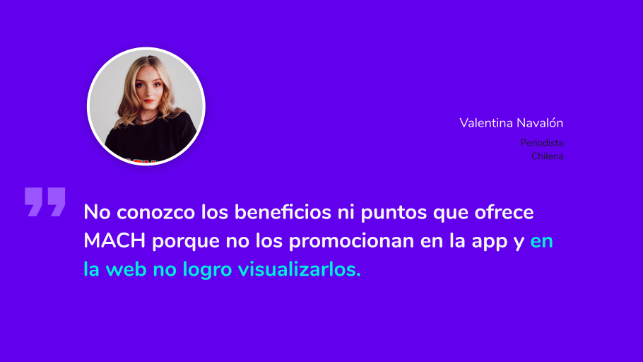
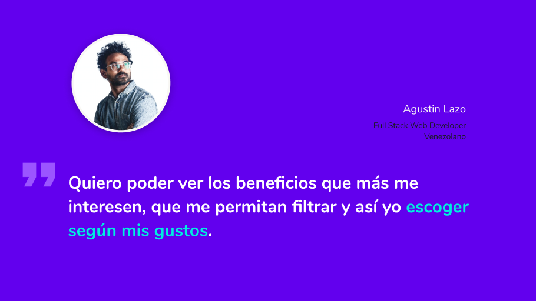

# Mach Beneficios

## Índice

* [1. Mach.](#1-Mach)
* [2. Comenzando a usarla.](#2-Comenzando-a-usarla)
* [3. Investigación.](#3-Investigación)
    - [3.1 Benchmark.](#31-Benchmark)
    - [3.2 Entrevista con usuarios.](#32-Entrevista-con-usuarios)
    - [3.3 User persona.](#33-User-persona)
    - [3.4 Insights.](#34-Insights)
    - [3.5 Análisis heurístico.](#35-Análisis-heurístico)
* [4. Proceso de prototipado y diseño.](#4-Proceso-de-Prototipado-y-diseño)
* [5. Aportes.](#5-Aportes)
* [6. Despliegue.](#10-Despliegue)
* [7. Herramientas.](#7-Herramientas)
* [8. Autoras.](#8-Autoras)

***

## 1. Mach

**¿Qué es Mach?**

**MACH** Es la forma más fácil de pagar a tus contactos y comprar en comercios internacionales.

En **MACH** premiamos tu lealtad con los mejores beneficios, es por ello que queremos que tengas toda la información necesaria para que puedas comenzar a disfrutar de todo lo que **Mach** tiene para ofrecerte.

Puedes conocerla y probarla [aquí](https://hackathon-mach.web.app/).

## 2. Comenzando a usarla 🚀

Implementado como un SPA (*Single Page Application*), desarrollada con **React** y desplegada en Hosting **Firebase** para su uso en Desktop a través de cualquier navegador web.

## 3. Investigación 👀

En esta etapa pudimos realizar una investigación para conocer más sobre los Beneficios de ***Mach***

En este proceso investigativo realizamos:

### 3.1 Benchmark

(Estudio de mercado, directo e indirecto).
Puedes revisarlo [aqui](https://docs.google.com/spreadsheets/d/1dQnv5AJW8DxrpCu-ok-u4Y_LH_dwiY0M/edit?usp=drive_web&ouid=103640674254094711703&rtpof=true)

### 3.2 Entrevista con usuarios

Entrevista con Usuarios: (Conocer opiniones sobre el sitio actual y encontrar ideas para potenciarlo).

1. [Mario Rocca](https://drive.google.com/drive/folders/1PNE_NR9NlQWFkVEwJxddpj4pXSuYIa37)
2. [Francisco Maduro](https://drive.google.com/drive/folders/1PNE_NR9NlQWFkVEwJxddpj4pXSuYIa37)

### 3.3 User persona

(Personaje ficticio que representa un usuario de la plataforma).

### 3.4 Insights

(Descubrimientos).

### 3.5 Análisis heurístico

Puedes revisarlo [aqui](https://docs.google.com/spreadsheets/d/1ooQS2eE9-tJDUIGaZU23ikogfsBBGLC9/edit?usp=drive_web&ouid=103640674254094711703&rtpof=true)

## 4. Proceso de prototipado y diseño📋

**Prototipo de alta fidelidad - WEB**
Comenzamos construyendo nuestro prototipo de alta fidelidad en base a la investigación previa, para la web de Beneficios de **Mach**.
Puedes revisarlo [aquí](https://www.figma.com/file/HSayHEIuRomysC8t0qb4dn/MACH?node-id=259%3A1777)

**Prototipo de alta fidelidad - APP**
También diseñamos y prototipamos los Beneficios y la gamificación de **Mach** pero en la versión para APP.  
Puedes revisarlo [aquí](https://www.figma.com/proto/HSayHEIuRomysC8t0qb4dn/MACH?node-id=374%3A2238&scaling=contain).

**Guia de Estilo**

## 5. Aportes 💜

Aqui una pequeña lista con los aportes ofrecidos a la sección de Beneficios de  ***Mach***:

## 6. Despliegue 📦

Puedes acceder al deploy de nuestro proyecto [aquí](https://hackathon-mach.web.app/).

## 7. Herramientas 🛠️

En éste proyecto fueron utilizadas varias herramientas para llegar al resultado del producto entregado.
Las herramientas usadas fueron:

* [Figma.](https://www.figma.com/file/HSayHEIuRomysC8t0qb4dn/MACH?node-id=0%3A1) – Para el prototipado de alta fidelidad.
* [Firebase](https://firebase.google.com) – Para el hosting.
* [Git y GitHub](https://github.com/xsamynox/Hackathon-mach) – Para el trabajo colaborativo.
* [Boostrap](https://getbootstrap.com/) - Para algunos elementos simples.
* [Reactstrap](https://www.npmjs.com/package/reactstrap) - Para algunos elementos simples.
* [ReactRouter](https://reactrouter.com/) - Para la creación de una SPA.

## 8. Autoras ✒️

Éste proyecto fue realizado en conjunto por alumnas de la generación 014 de Santiago, Chile de Laboratoria.

* **Namastheys Soledad** [Portafolio](https://namastheysbastardo.com/) 📝✨ - UX/UI Designer
* **Lady Pino** [GitHub](https://github.com/Ladypino) :octocat: - Front-end Developer
* **Fabiane Santos** [GitHub](https://github.com/FabianeSantos) :octocat: - Front-end Developer
* **Yndira Natera** [GitHub](https://github.com/naterayc) :octocat: - Front-end Developer
* **Samantha Moreno** [GitHub](https://github.com/xsamynox) :octocat: - Front-end Developer
